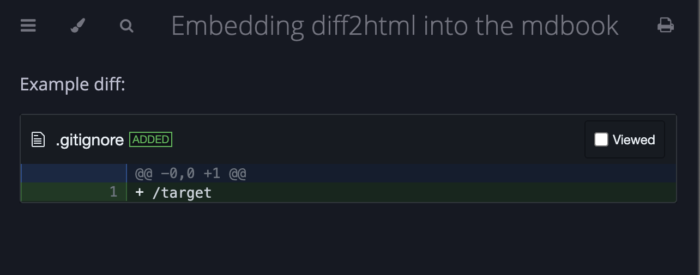

# Embed diff2html into the mdbook

**[diff2html](https://diff2html.xyz/)** is a diff parser and pretty HTML generator that can show diffs on a HTML page.

**[mdbook](https://rust-lang.github.io/mdBook/)** is a command line tool to create books using Markdown. It is written in Rust and widely used by Rust developers.

This small project allows you to use **diff2html** to render diffs directly inside an **mdbook**.

## Usage

1. Put the `diff2html.js` file from this repository next to your `book.toml` file. 

2. In `book.toml`, add `diffhtml.js` to `additional-js` array under the `[output.html]` section:
```toml
[output.html]
additional-js=["diff2html.js"]
```

3. Inside your markdown files, add a code block with the language set to `diff2html`:
````
Example diff:
```diff2html
diff --git a/.gitignore b/.gitignore
new file mode 100644
index 0000000..ea8c4bf
--- /dev/null
+++ b/.gitignore
@@ -0,0 +1 @@
+/target
```
````

This will be rendered as a visual diff using **diff2html**.


The test book from this repository is available at [https://romamik.github.io/mdbook-diff2html/](https://romamik.github.io/mdbook-diff2html/).

## License

Public domain.